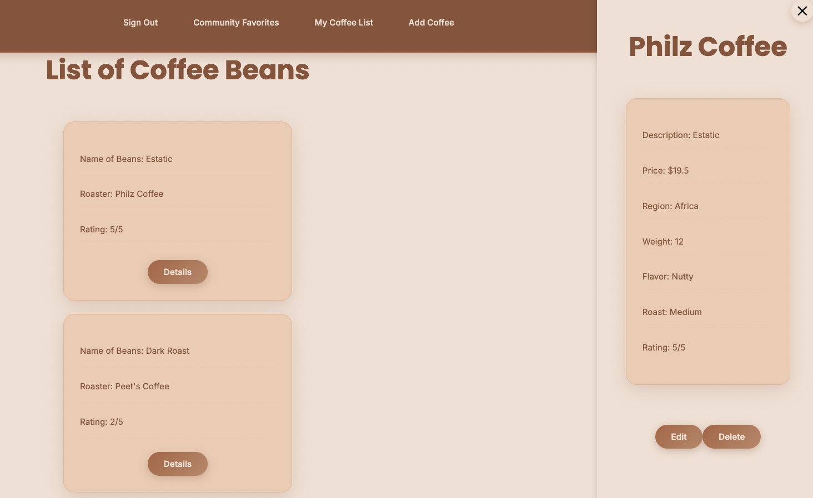
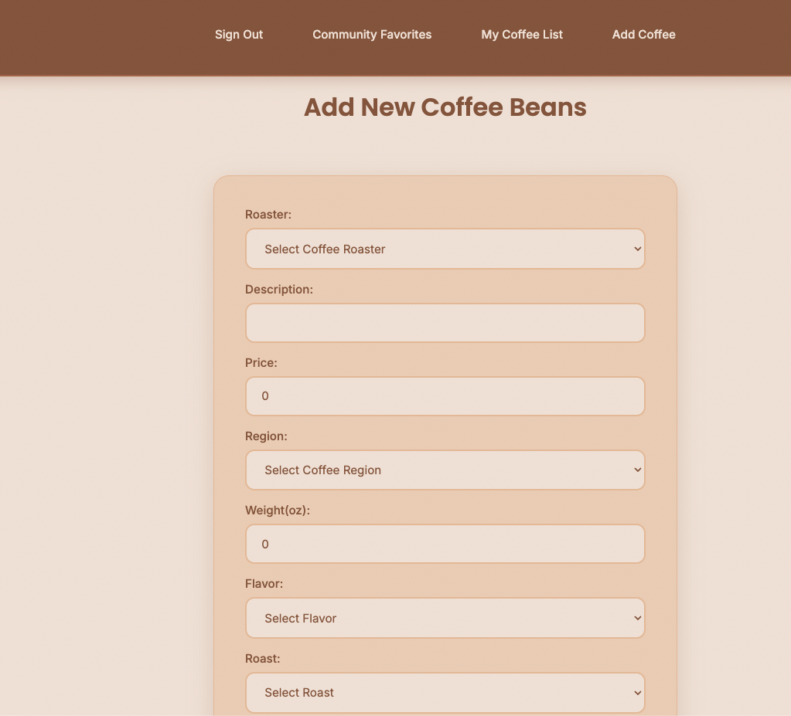

# Grounds for Debate ☕

A full-stack coffee bean tracking application built with the MERN stack. Track your favorite coffee beans, rate them, and discover community favorites!

## 📸 Screenshots

### Landing Page


### Coffee List


### Add Coffee


## 🚀 Getting Started

### Deployed App
[Grounds for Debate - Live Demo](https://grounds-for-debate.onrender.com)

### Planning Materials
- [Trello Board](your-trello-link)
- [Wireframes](your-wireframe-link)

## 📝 Description

Grounds for Debate is a personal coffee bean tracker that allows coffee users to catalog and rate their coffee experiences. Users can add beans from various roasters, track flavor profiles, roast levels, and prices, while also viewing community top-rated coffees.

### Key Features
- **User Authentication**: Secure signup and login with JWT tokens
- **Coffee Management**: Add, edit, view, and delete coffee beans
- **Detailed Tracking**: Record roaster, region, flavor profile, roast level, price, and rating
- **Community Favorites**: View top-rated coffees aggregated across all users
- **Sidebar Details**: Quick view coffee details without leaving the main list
- **Responsive Design**: Beautiful coffee-themed UI with warm color palette

## 🛠️ Technologies Used

### Frontend
- React
- Axios
- Vite
- CSS

### Backend
- Node.js
- Express 
- MongoDB & Mongoose
- JWT Authentication
- Bcrypt.js
- CORS

### Deployment
- Render (Full-stack deployment)

## ⚡ Future Enhancements

- [ ] Brewing method tracking
- [ ] Tasting notes with multiple flavor descriptors
- [ ] Photo uploads for coffee bags
- [ ] Coffee journal entries
- [ ] Share coffee recommendations with friends
- [ ] Filter and sort by roaster, region, or rating
- [ ] Coffee brewing timer and recipes
- [ ] Price tracking over time
- [ ] Favorite/wishlist functionality
- [ ] Export coffee collection to PDF

## 📦 Installation

If you want to run this project locally:

1. Clone the repository
```bash
git clone https://github.com/yourusername/grounds-for-debate.git
cd grounds-for-debate
```

2. Install dependencies for both client and server
```bash
# Install server dependencies
cd server
npm install

# Install client dependencies
cd ../client
npm install
```

3. Create environment variables

Server `.env`:
```
MONGODB_URI=your_mongodb_connection_string
JWT_SECRET=your_jwt_secret
PORT=3000
```

Client `.env`:
```
VITE_SERVER_URL=http://localhost:3000
```

4. Run the application
```bash
# Terminal 1 - Run server
cd server
npm run devStart

# Terminal 2 - Run client
cd client
npm run dev
```

5. Open your browser to `http://localhost:5173`

## 👤 Author

**Your Name**
- GitHub: [@jpangi](https://github.com/jpangi)
- LinkedIn: [Jacob Pangilinan](https://www.linkedin.com/in/jacob-pangilinan/)

## 📄 License

This project is open source and available under the [MIT License](LICENSE).

## 🙏 Acknowledgments

- Coffee roasters listed are real specialty coffee companies
- Inspired by the joy of coffee discovery
- Built as part of General Assembly's Software Engineering Immersive

---

*Made with ☕ and React*